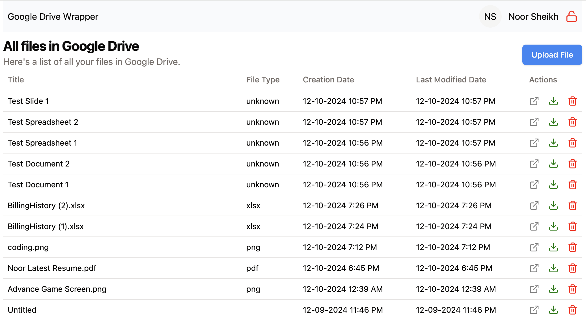

# Google Drive Wrapper App

## Overview

This application itegrate with Google Drive via the Google Drive API, offering a user-friendly interface for managing files stored in cloud. It allows users to securly login using their Google account via OAuth 2.0, ensuring data privacy and compliance with Google's authentication standards.

## App Features

- View all files stored in Google Drive in a table.
- Upload new files to Google Drive.
- Download files from Google Drive.
- Remove files from Google Drive.

## Technologies Used

- **Backend:** NodeJs, ExpressJS, JavaScript/TypeScript
- **Frontend:** ReactJs, Context API (for store management), TailwindCSS, Shadcn/ui
- **DevOps:** Docker

## Local Environment Setup Guide

Before spinning up local dev environment, it is required to first setup Google Client ID by following [this](https://developers.google.com/identity/gsi/web/guides/get-google-api-clientid) guide. Once the Google Client ID is successfully obtained, next enable the Google Drive API using [this](https://help.scriptcase.net/portal/en/kb/articles/enabling-google-drive-api-on-the-google-console#Creating_a_Project) guide.

### Running Project on Personal PC (without Docker)

NOTE: Make sure `node` with version `20 or above` is running on your personal PC. It can be download from [here](https://nodejs.org/en).
Guide for running app locally.

- Run the server first using below guide:
  - Navigate to `./server` directory.
  - Install npm packages using CLI from server directory using `npm install`.
  - Once the packages are successfully installed, run `npm run start` to start the server.
  - Visit `http://localhost:3000` to access the APIs.
- Once the server is successfully start, next step is to start the client using below guide.
  - Navigate to `./client` directory.
  - Install npm packages using CLI from client directory using `npm install`.
  - Once the packages are successfully installed, run `npm run dev` to start the client.
  - Visit `http://localhost:5173` to access the UI.

### Running Project in Docker Environment

If you don't want to go the above route of installing node and the npm dependencies from your local PC. The project is also dockerized for easy local environment setup. Download Docker Desktop from [here](https://www.docker.com/get-started/).

Once the Docker Desktop is successfully installed and running in background, use below guide to spin up docker containers for spinning up both server and client.

- From the root directory of the project run `docker-compose build` using CLI to download the docker images and build the containers.
- Once the docker build command is successfully executed, run `docker-compose up` from CLI to spin up the docker containers.
- When the docker compose command is successfully started, it will show below logs in the terminal with both client and server addresses.

```
 ✔ Container google-drive-wrapper-app-client-1  Created                                                                                                                                                                        0.0s
 ✔ Container google-drive-wrapper-app-server-1  Created                                                                                                                                                                        0.0s
Attaching to client-1, server-1
client-1  |
client-1  | > google-drive-wrapper-app@0.0.0 dev
server-1  |
client-1  | > vite --host
server-1  | > google-driver-wrapper-server@0.0.1 start
client-1  |
server-1  | > npx ts-node ./src/server.ts
server-1  |
client-1  | Re-optimizing dependencies because lockfile has changed
client-1  |
client-1  |   VITE v6.0.3  ready in 424 ms
client-1  |
client-1  |   ➜  Local:   http://localhost:5173/
client-1  |   ➜  Network: http://172.19.0.2:5173/
server-1  | Server address: http://localhost:3000.
```

### Finally once the above is completed successfully, this is how the UI will look like.

#### Login Screen


#### Home Screen


